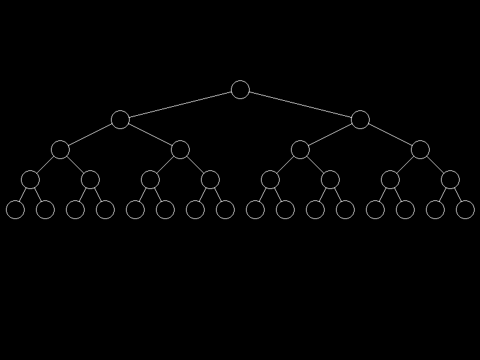
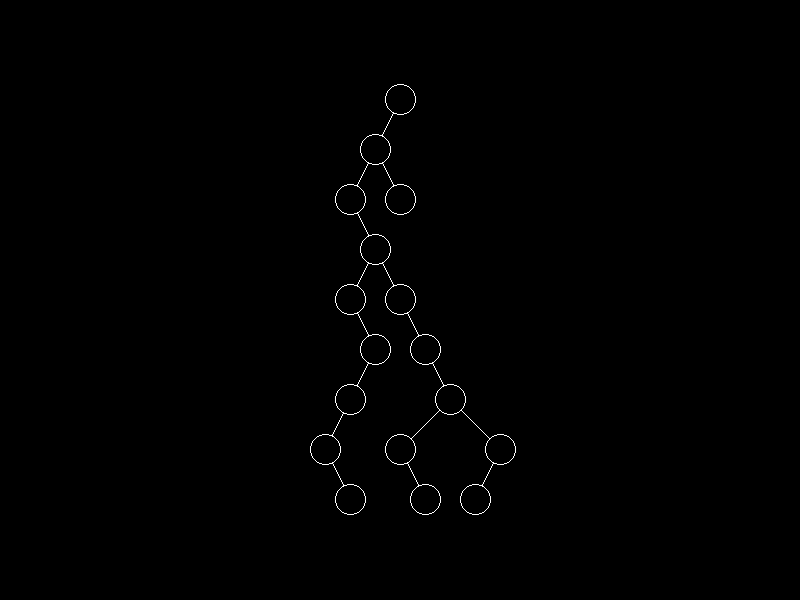
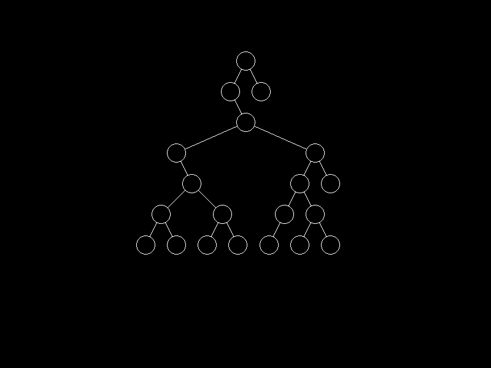
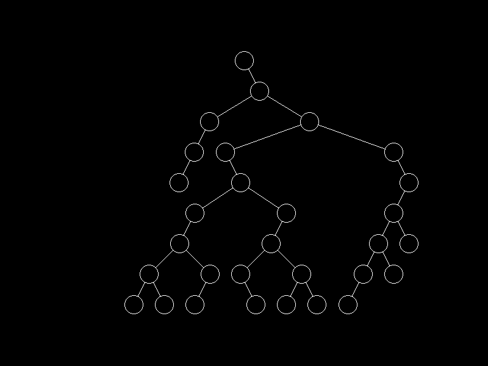

# tidier-trees

An implementation of the [Tidier Drawings of Trees](https://reingold.co/tidier-drawings.pdf) paper by Reginold and Tilford. 

|  |  |
| ---------------------------------------------------------- | ---------------------------------------------- |
|                              |                  |

## Features

* Uses OpenGL to draw the points on screen
* Custom rasterization of lines and circles using Bresenham's midpoint algorithm
* Supports zoom and scrolling of camera
* Includes a random tree generator to provide virtually endless test cases

## How to run

* Only tested on Linux. You may need to do some Windows-specific modifications to compile the project there. 
* Required libraries:
    * `GL`
    * `GLFW`
    * `GLEW`
* Use `cmake` to build the project: `cmake -G "CodeBlocks - Unix Makefiles" /path/to/tidier-trees`
* Run the output executable `tidier_trees`
